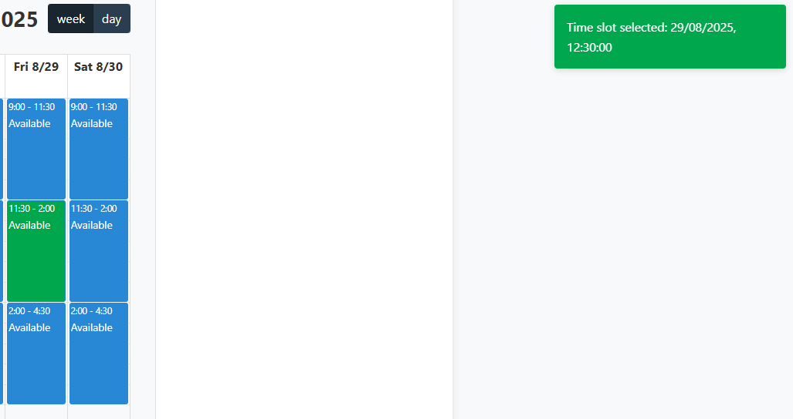
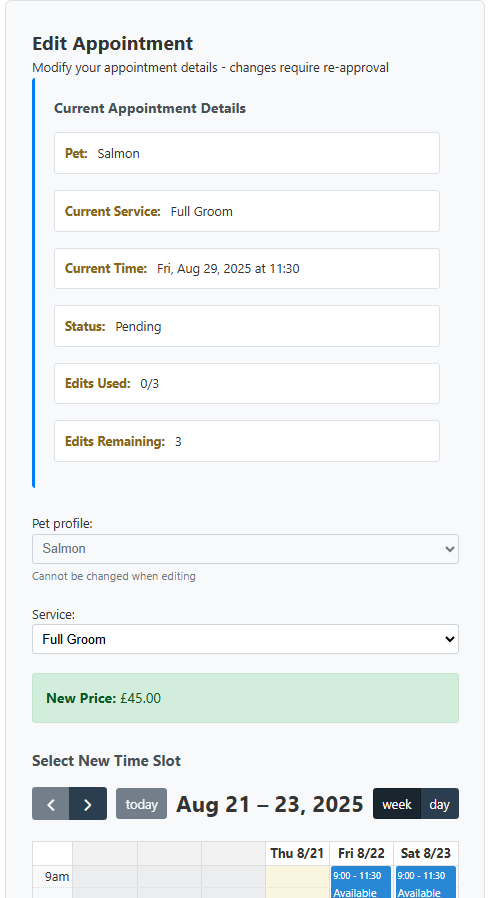

# Dog Booking System

## Features

This web application is a booking and management system for a pet grooming business. It supports multiple user roles and provides role-based access to all features.

### Main Pages and Features

- Home page
- Login page
- Registration page (for clients)
- Logout page
- Dashboard (role-based: client, employee, manager)
- Profile page
- Edit profile page
- Change password page
- Delete account page (self-delete for clients; managers can delete any user)
- Pet management (add, edit, delete pets)
- Booking management (create, edit, delete appointments)
- Appointment detail page
- Employee schedule (day/week view)
- Manager time management (assign pending appointments to employees)
- User management (manager only: approve, edit, delete users)
- Service management (manager only: add, edit, delete, activate/deactivate services and pricing)
- Error pages (400, 403, 404, 500)

---

### Access to Pages by User Role

| Page/Feature                | Client | Employee | Manager | Admin (Django) |
|-----------------------------|--------|----------|---------|---------------|
| Home                        | Y      | Y        | Y       | Y             |
| Login/Logout                | Y      | Y        | Y       | Y             |
| Registration                | Y      | Y        | Y       | N             |
| Dashboard                   | Y      | Y        | Y       | N             |
| Delete Account              | N      | N        | Y       | N             |
| Pet Management              | Y      | N        | Y       | N             |
| Booking Management          | Y      | N        | Y       | N             |
| Appointment Detail          | Y      | Y        | Y       | N             |
| Employee Schedule           | N      | Y        | Y       | N             |
| Manager Time Management     | N      | N        | Y       | N             |
| User Management             | N      | N        | Y       | N             |
| Service Management          | N      | N        | Y       | N             |
| Django Admin                | N      | N        | N       | Y             |

- **Clients** can manage their own pets and appointments (edit/delete only if 24+ hours in advance).
- **Employees** can view their own schedule (day/week).
- **Managers** can manage all users, pets, appointments, and services, and assign appointments to employees.
- **Admin** access is via Django admin only.

---

### Navigation

**Navbar**

- The navbar is implemented in `base.html` and adapts to the user's role, providing links to relevant sections (Dashboard, Pets, Bookings, Schedule, Profile, Logout, etc.).
- No logo is used.

**Footer**

- The footer contains business contact information and copyright.
- All links are working and include my personal GitHub and LinkedIn account.

---

### Page Descriptions

#### Home Page

- Welcome message and call-to-action for registration or login.

#### Registration Page

- Form for new users to sign up.

#### New User Notification

- After registration, managers must approve users before logging in.
- Clear feedback is given to the users.

#### Wrong Credentials

- Comprehensive feedback is given throughout

#### Dashboard

- Role-based dashboard:
  - **Client:** Upcoming appointments, pets, quick actions.
  
  - The client dashboard features an overview of upcoming appointments (as well as past, or rejected ones if applicable), and a sidebar for user actions.

  - **Employee:** Today's and week's schedule.
  
  - The employee dashboard is kept minimalistic for now. See further documentation.

  - **Manager:** Pending appointments, staff assignments, user/pet management.
  
  - The manager dashboard shows a comprehensive list of tasks and options (scaled down for the screenshot). This includes "Pending Requests" that require attention, and general functionality, like editing services or managing users and pets.

#### Client Actions

Below are screenshots of actions a client can take:

Showing the user upcoming appointments, with the option to edit or cancel (more than 24hrs in advance).

The client is shown a confirmation they have selected the slot.

The user is notified that the appointment is being reviewed.

The client can edit their appointment. Previous info will still be shown.

The client can cancel an appointment (more than 24hrs in advance).

The client can add their pet.

The client can edit their pet. The profile will be "Pending" again.

The user can remove a pet from their account.

#### Manager Actions

The comprehensive manager dashboard shows "Pending Requests" with icons, should there be any requests, that need attention. Otherwise they are greyed out.
All actions can be accessed from the "Quick Actions" sidebar.

#### Profile & Edit Profile

- [Placeholder: Profile page image]
- View and edit personal information.

#### Change Password

- [Placeholder: Change password page image]
- Update account password.

#### Delete Account

- [Placeholder: Delete account page image]
- Clients and managers can delete their own accounts. Managers can delete any user.

#### Pet Management

- [Placeholder: Pet management page image]
- Clients and managers can add, edit, or delete pet profiles.

#### Booking Management

- [Placeholder: Booking management page image]
- Clients can create, edit, or delete their own appointments (if 24+ hours in advance).
- Managers can manage all appointments.

#### Appointment Detail

- [Placeholder: Appointment detail page image]
- View details of a specific appointment.

#### Employee Schedule

- [Placeholder: Employee schedule page image]
- Employees can view their own schedule (day/week).
- Managers can view all schedules.

#### Manager Time Management

- [Placeholder: Manager time management page image]
- Managers can assign pending appointments to employees.

#### User Management (Manager Only)

- [Placeholder: User management page image]
- Managers can view, approve, edit, or delete users.

#### Service Management (Manager Only)

- [Placeholder: Service management page image]
- Managers can add, edit, delete, activate/deactivate services and manage pricing.

#### Error Pages

- Friendly error messages for bad requests, forbidden access, not found, and server errors.

These exist for **400, 403, 404, 500** errors

---

### Mobile Responsiveness

- All pages are responsive and adapt to mobile devices.
- Navigation and actions are accessible on all screen sizes.

---

### Favicon

- [Placeholder: Favicon image]
- A small icon for browser tabs.

---

## Future Improvements

The current version of the Dog Booking System serves as a robust foundation, but several planned enhancements could significantly improve functionality, usability, and business value:

- **Grooming Logs for Staff**: Implement a private logging system where employees and managers can leave internal comments or notes after each grooming session. These logs would be accessible only to staff and linked to pet profiles for future reference.
- **Image Uploads**: Allow users to upload profile pictures for pets and include image attachments in staff logs (e.g., for before/after grooming shots or special instructions).
- **Email Notifications**: Integrate automated email functionality for booking confirmations, appointment reminders, cancellations, and other system alerts.
- **Expanded Employee Dashboard**: Enable employees to:
  - Request time off (with approval workflows)
  - View their full grooming schedule
  - Access pet profiles for upcoming appointments
- **Voucher System**: Introduce a system for special offers (e.g., birthday vouchers) with optional discount codes that can be tracked and managed by managers.

These features are intentionally modular and designed for future scalability.