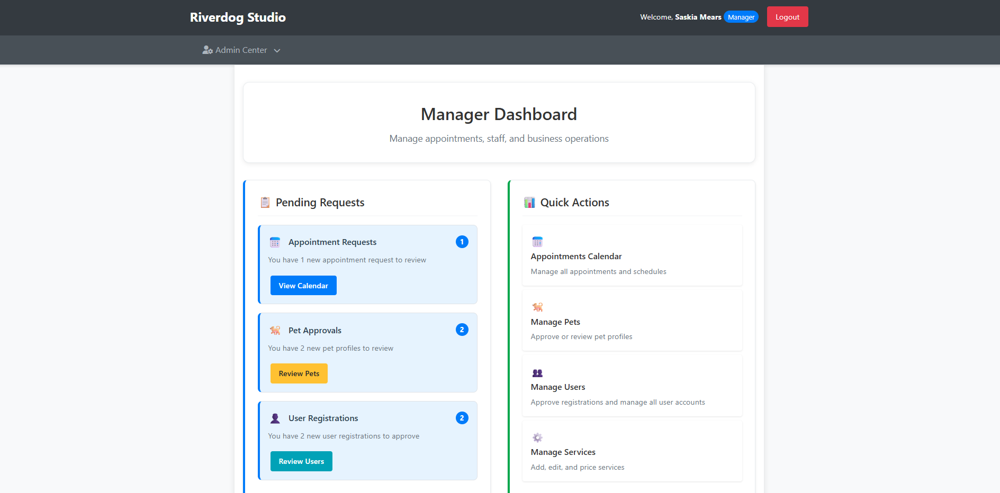
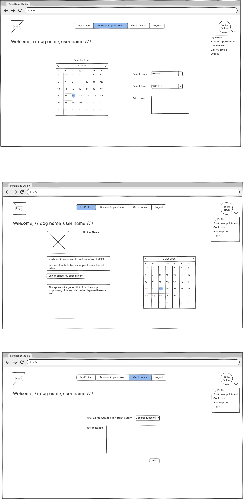
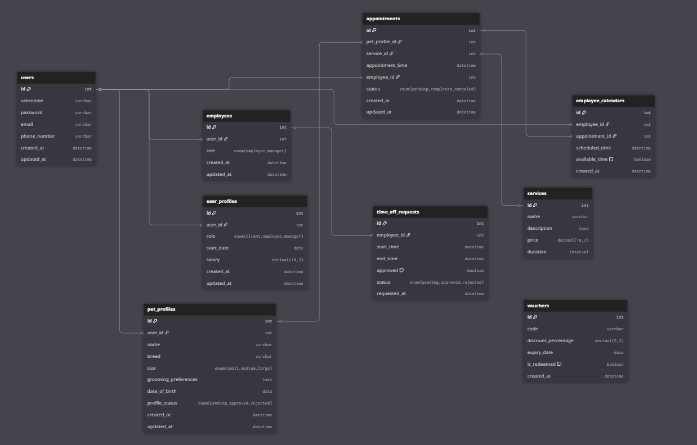

# Dog Booking System

**Live Version:** [Dog Booking System](https://dog-booking-system-1eebcb797de9.herokuapp.com/)  
**Repository:** [GitHub Repo](https://github.com/Kerem-Haeger/dog_booking_system)  
**Author:** [Kerem Haeger](https://github.com/Kerem-Haeger)



---

## About

The **Dog Booking System** is a full-featured pet grooming and service management platform tailored for grooming businesses. It simplifies the management of clients, pets, appointments, and staff through role-based access control. The primary goal is to streamline daily operations, reduce scheduling conflicts, and enhance the client experience.

---

## User Experience Design

### Strategy

The system was designed with simplicity and clarity in mind. By focusing on the specific needs of grooming businesses, it offers intuitive dashboards, smart scheduling, and seamless client interaction. Role-based interfaces ensure that each user type—manager, employee, or client—has access only to relevant tools and views.

### Target Audience

- **Managers**: Oversee operations, manage users and services, approve appointments and pet profiles.
- **Employees**: View and manage their appointment schedules, update statuses, and access client/pet info.
- **Clients**: Register pets, request services, track appointments, and manage profiles.

### User Stories

The Dog Booking System was developed with different user types in mind, ensuring that their goals and expected behaviors are addressed through clear and practical features. The full breakdown of individual user stories and issue tracking is available in [TESTING.md](documentation/TESTING.md).

#### First-Time Visitors
- Easily understand the layout and navigation.
- Register for an account with minimal effort.
- Quickly grasp the value and benefits of using the service.

#### Frequent Users
- Access a secure login system.
- Log in to a personal dashboard tailored to their role.
- Easily see upcoming appointments on the dashboard.
- Have easy access to editing pet profiles and appointments.

#### Clients
- Add and manage dog profiles for one or more pets.
- Book appointments with available groomers based on verified pet details.
- View appointment history, including past, pending, and rejected visits.
- Modify or cancel upcoming bookings when needed.
- Review available services and pricing based on their dog's size.

#### Employees
- View upcoming appointments assigned to them in a calendar or list view.
> **Info:** The employee portal will be further enhanced in future iterations. This version prioritizes a smooth and functional experience for clients and managers to deliver immediate business value.

#### Managers
- Approve or reject new pet profiles, appointments, and users.
- Assign new users roles (client, employee, manager).
- Oversee all bookings and employee schedules.
- Manage the services offered, including durations and availability.
- View a global calendar overview for better workload management.
- Assign and modify user roles (e.g., promote employee to manager).

---

## Technologies Used

### Languages

- [Python 3.12](https://www.python.org/downloads/release/python-3120/)
- [JavaScript](https://developer.mozilla.org/en-US/docs/Web/JavaScript)
- [HTML5](https://developer.mozilla.org/en-US/docs/Web/Guide/HTML/HTML5)
- [CSS](https://developer.mozilla.org/en-US/docs/Web/CSS)

### Frameworks and Libraries

- [Django 4.2](https://docs.djangoproject.com/en/4.2/) – Backend web framework
- [jQuery](https://jquery.com/) – DOM manipulation and AJAX
- [FullCalendar 6.1](https://fullcalendar.io/) – Interactive calendar views
- [AJAX](https://developer.mozilla.org/en-US/docs/Web/Guide/AJAX) – For real-time UI updates

### Databases

- [SQLite](https://www.sqlite.org/index.html) – Used during development
- [PostgreSQL](https://www.postgresql.org/) – Used in production, hosted via [Neon](https://neon.tech/)

### Developer Tools

- [GitHub](https://github.com/) – Version control
- [Gunicorn](https://gunicorn.org/) – WSGI HTTP server for production
- [Psycopg2](https://www.psycopg.org/) – PostgreSQL adapter for Python
- [pip3](https://pip.pypa.io/en/stable/) – Python package installer
- [VSCode](https://code.visualstudio.com/) – Integrated Development Environment
- [Chrome DevTools](https://developer.chrome.com/docs/devtools/) – Browser debugging tools
- Validators:
  - [W3C CSS Validator](https://jigsaw.w3.org/css-validator/)
  - [JSHint](https://jshint.com/)
  - [PEP8 (flake8)](https://flake8.pycqa.org/en/latest/) – Python code style
  - [djLint](https://www.djlint.com/) – Linter for Django & HTML templates (used in VSCode)
- [Font Awesome](https://fontawesome.com/) – Icon library


---

## Project Structure

The project follows a modular structure designed for scalability and maintainability. All core functionality is organized within a dedicated Django app (`core/`), which is further split into subdirectories for views, templates, static files, and role-specific logic. Views are separated into modules (e.g. `client_views`, `manager_views`) to keep responsibilities clear and code organized. Static and template files are grouped by feature for easier maintenance. Environment configuration, deployment files, and reusable components like custom template tags and context processors are also included.

```
dog_booking_system/
├── booking_system/                 # Main Django project directory
│   ├── __init__.py
│   ├── asgi.py                    # ASGI configuration
│   ├── settings.py                # Django settings
│   ├── urls.py                    # Main URL configuration
│   ├── wsgi.py                    # WSGI configuration
│   └── templates/
│       └── registration/          # Authentication templates
│           ├── login.html
│           └── register.html
│
├── core/                          # Main application directory
│   ├── __init__.py
│   ├── admin.py                   # Django admin configuration
│   ├── apps.py                    # App configuration
│   ├── context_processors.py     # Custom context processors
│   ├── forms.py                   # Django forms
│   ├── models.py                  # Database models
│   ├── urls.py                    # App URL patterns
│   ├── utils.py                   # Utility functions
│   ├── views.py                   # Legacy views (kept for compatibility)
│   │
│   ├── views/                     # Organized view modules
│   │   ├── __init__.py
│   │   ├── api_views.py          # AJAX and API endpoints
│   │   ├── auth_views.py         # Authentication views
│   │   ├── client_views.py       # Client-specific views
│   │   ├── employee_views.py     # Employee-specific views
│   │   ├── manager_views.py      # Manager-specific views
│   │   └── roles.py              # Role-based mixins and utilities
│   │
│   ├── migrations/               # Database migrations
│   │   ├── __init__.py
│   │   ├── 0001_initial.py
│   │   └── ...
│   │
│   ├── static/core/              # Static files
│   │   ├── css/
│   │   │   ├── base.css          # Base styling
│   │   │   ├── dashboard.css     # Dashboard styling
│   │   │   ├── forms.css         # Form styling
│   │   │   ├── user-management.css
│   │   │   ├── pet_management.css
│   │   │   └── ...
│   │   └── js/                   # JavaScript files
│   │
│   ├── templates/core/           # Application templates
│   │   ├── base.html            # Base template
│   │   ├── dashboard/           # Dashboard templates
│   │   ├── appointments/        # Appointment templates
│   │   ├── pets/               # Pet management templates
│   │   ├── users/              # User management templates
│   │   └── ...
│   │
│   └── templatetags/            # Custom template tags
│       ├── __init__.py
│       └── form_tags.py
│
├── staticfiles/                  # Collected static files (production)
├── templates/                    # Global templates
│   ├── 400.html                 # Error pages
│   ├── 403.html
│   ├── 404.html
│   └── 500.html
│
├── .venv/                       # Virtual environment
├── manage.py                    # Django management script
├── requirements.txt             # Python dependencies
├── env.py                       # Environment variables
├── Procfile                     # Deployment configuration
├── db.sqlite3                   # Local development database
├── .gitignore                   # Git ignore rules
└── README.md                    # Project documentation
```

### Key Files and Directories:

- **booking_system/**: Contains the main Django project configuration
- **core/**: The primary application handling all business logic
- **core/views/**: Organized view modules separated by user roles and functionality
- **core/models.py**: Database models for User, Pet, Appointment, and Service management
- **core/static/**: CSS and JavaScript files for frontend functionality
- **core/templates/**: HTML templates organized by feature
- **env.py**: Environment variables including database configuration
- **requirements.txt**: All Python package dependencies

---

## Features

See [FEATURES.md](FEATURES.md) for a comprehensive breakdown of implemented and planned features.

---

## Design

The application adheres to modern UI/UX design principles with an emphasis on:

- Simplicity and clarity
- Accessibility and responsiveness
- Role-specific user flows

The visual design of the Dog Booking System prioritizes usability and clarity. The layout follows a clean, modern aesthetic that supports intuitive navigation for all user roles — clients, employees, and managers.

### Layout and Interface

The interface uses clearly defined sections, such as dashboards and quick-access panels, to highlight important tasks like appointment approvals and user management. Icons and color-coded cards improve at-a-glance recognition and reduce cognitive load.

### Color Scheme

The system adopts a bold but functional color palette, using soft backgrounds with distinct color highlights for different actions (e.g., blue for appointments, green for confirmations, orange for actions). This ensures consistency while guiding user attention effectively.

### Typography

A clean, sans-serif font is used across the application to ensure readability on both desktop and mobile devices. Font sizes and weights are varied to emphasize key information such as headings and action buttons.

### Visual Design

- **Color Palette**: Blues and grays to promote professionalism and calm
- **Typography**: System font stack for speed and consistency
- **Buttons**: Semantic coloring for UX clarity
- **Imagery**: Minimal, icon-driven design via Font Awesome

### Responsiveness

The UI adapts to various screen sizes to ensure accessibility on desktops, tablets, and mobile devices. Core features remain accessible regardless of screen width. See [TESTING.md](TESTING.md) for responsiveness tests.

### Icons and Visuals

Icons from [Font Awesome](https://fontawesome.com/) are used throughout the platform to support key actions and improve visual recognition. These icons help distinguish between sections such as appointments, pet profiles, and user registration.

### Wireframes

Initial wireframes were created to outline the structure and flow of the 
application. However, during development, the project evolved significantly 
to prioritize usability, technical feasibility, and user feedback. As a 
result, the final implementation deviates from the original wireframes in 
several areas. These changes occurred organically throughout the production 
phase and were necessary to deliver a smoother, more functional user 
experience.

-   

---

## Information Architecture

### Database Design

- Development: SQLite  
- Production: PostgreSQL on Neon

### Data Models

A detailed Entity-Relationship (ER) diagram was created to plan and 
visualize the database structure. This diagram reflects the relationships 
between users, pets, appointments, and other key entities.  
You can find the ER diagram in the screenshot provided below.



### Databases ###

1. **User (Django's built-in User model)**

Extended through UserProfile for additional functionality.

| Name          | Database Key  | Field Type    | Validation |
| ------------- | ------------- | ------------- | ---------- |
| Username      | username      | CharField     | max_length=150, unique=True |
| Email         | email         | EmailField    | max_length=254, optional |
| First Name    | first_name    | CharField     | max_length=150 |
| Last Name     | last_name     | CharField     | max_length=150 |
| Password      | password      | CharField     | Django's built-in validation |

2. **UserProfile**

Extends the User model with role-based functionality.

| Name          | Database Key  | Field Type    | Validation |
| ------------- | ------------- | ------------- | ---------- |
| User          | user          | OneToOneField | User, on_delete=models.CASCADE |
| Role          | role          | CharField     | max_length=20, choices=ROLE_CHOICES |

```Python
ROLE_CHOICES = [
    ('pending', 'Pending Approval'),
    ('client', 'Client'),
    ('employee', 'Employee'),
    ('manager', 'Manager'),
]
```

3. **PetProfile**

Stores information about pets registered in the system.

| Name          | Database Key  | Field Type    | Validation |
| ------------- | ------------- | ------------- | ---------- |
| User          | user          | ForeignKey    | User, on_delete=models.CASCADE |
| Name          | name          | CharField     | max_length=100 |
| Breed         | breed         | CharField     | max_length=100 |
| Size          | size          | CharField     | max_length=20, choices=SIZE_CHOICES |
| Age           | age           | PositiveIntegerField |  |
| Special Notes | special_notes | TextField     | blank=True |
| Status        | status        | CharField     | max_length=20, choices=STATUS_CHOICES |

```Python
SIZE_CHOICES = [
    ('small', 'Small (0-25 lbs)'),
    ('medium', 'Medium (26-60 lbs)'),
    ('large', 'Large (61-100 lbs)'),
    ('extra_large', 'Extra Large (100+ lbs)'),
]

STATUS_CHOICES = [
    ('pending', 'Pending Approval'),
    ('approved', 'Approved'),
    ('rejected', 'Rejected'),
]
```

4. **Service**

Defines available services and pricing.

| Name          | Database Key  | Field Type    | Validation |
| ------------- | ------------- | ------------- | ---------- |
| Name          | name          | CharField     | max_length=100 |
| Description   | description   | TextField     |  |
| Duration      | duration_minutes | PositiveIntegerField |  |
| Is Active     | is_active     | BooleanField  | default=True |
| Slot Interval | slot_interval | PositiveIntegerField | default=30 |

5. **ServicePrice**

Handles pricing based on pet size and service type.

| Name          | Database Key  | Field Type    | Validation |
| ------------- | ------------- | ------------- | ---------- |
| Service       | service       | ForeignKey    | Service, on_delete=models.CASCADE |
| Size          | size          | CharField     | max_length=20, choices=SIZE_CHOICES |
| Price         | price         | DecimalField  | max_digits=10, decimal_places=2 |

6. **Appointment**

Manages booking appointments for pet services.

| Name          | Database Key  | Field Type    | Validation |
| ------------- | ------------- | ------------- | ---------- |
| User          | user          | ForeignKey    | User, on_delete=models.CASCADE |
| Pet           | pet           | ForeignKey    | PetProfile, on_delete=models.CASCADE |
| Service       | service       | ForeignKey    | Service, on_delete=models.CASCADE |
| Date          | date          | DateField     |  |
| Time          | time          | TimeField     |  |
| Status        | status        | CharField     | max_length=20, choices=STATUS_CHOICES |
| Final Price   | final_price   | DecimalField  | max_digits=10, decimal_places=2 |
| Special Requests | special_requests | TextField | blank=True |
| Edit Count    | edit_count    | PositiveIntegerField | default=0 |

```Python
STATUS_CHOICES = [
    ('pending', 'Pending'),
    ('approved', 'Approved'),
    ('completed', 'Completed'),
    ('cancelled', 'Cancelled'),
    ('rejected', 'Rejected'),
]
```

---

## Testing

See [TESTING.md](TESTING.md) for a full overview of manual and automated tests.

---

## Deployment

Full instructions: see [DEPLOYMENT.md](DEPLOYMENT.md)

---

## Learning Outcomes

This project was part of my Diploma in Full Stack Software Development and has helped me solidify a wide range of development and project management skills.

### Key Takeaways

- **Full-Stack Application Development**: I successfully built a scalable web application using Django, PostgreSQL, JavaScript, and AJAX, with a strong emphasis on user roles and database relationships.
- **Modular and Role-Based Design**: I learned to structure logic and views in a maintainable way by separating functionality across user types (client, employee, manager).
- **Frontend/Backend Integration**: I gained practical experience in integrating real-time frontend functionality with backend validation and security using AJAX and Django forms.
- **Deployment**: I learned how to prepare, deploy, and maintain a Django project in a cloud-hosted environment.
- **Security and Access Control**: Implementing custom role-based permissions, input validation, and restricted views helped me understand key principles of secure development.

### Agile Reflections

Although I implemented an issue tracker to follow Agile principles, I acknowledge that my issue logs are out of sync with my current development progress. This has helped me realize the importance of consistent documentation and progress tracking. I now have a better understanding of Agile workflows and plan to apply this more rigorously in future projects.

---

## Credits

- [GitHub](https://github.com/) for hosting the project repository.
- [Django](https://www.djangoproject.com/) for the comprehensive web framework.
- [Neon](https://neon.tech/) for the cloud PostgreSQL database hosting.
- [Font Awesome](https://fontawesome.com/) for the comprehensive icon library.
- [Bootstrap](https://getbootstrap.com/) for responsive design components.
- [jQuery](https://jquery.com/) for enhanced JavaScript functionality.
- [PostgreSQL](https://www.postgresql.org/) for the robust database system.

---

## Acknowledgments

- Code Institute and mentor support  
- My partner Saskia, whose business this idea is based on
- Django and open-source communities for their documentation and libraries

---