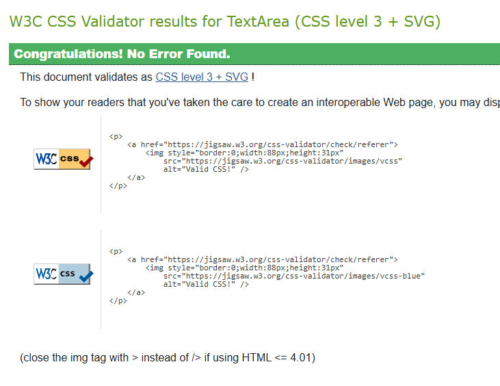
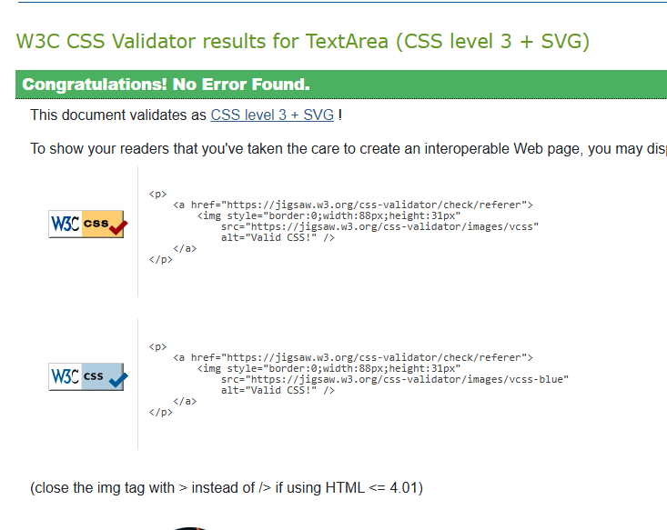

# Testing

## Manual Testing

Manual testing was conducted throughout development. Each feature was tested before merging into the main branch. Testing involved multiple user roles (**Clients**, **Employees**, and **Managers**) on various devices and browsers to ensure functionality and usability.

The table below outlines representative actions taken during testing:

### Client Actions

| Step | Action | Expected Result | Pass | Notes |
|------|--------|------------------|------|-------|
| 1 | Click "Sign In" | If credentials entered and existing, go to relevant dashboard | Y |  |
| 2 | Click "Create one here" | Redirect to registration form | Y |  |
| 3 | Submit registration with valid data | Profile submitted to manager for review/approval | Y |  |
| 4 | Log in with valid credentials | Redirect to dashboard | Y |  |
| 5 | Navigate to "Pet Profiles" | List of pets (or prompt to add new) | Y |  |
| 6 | Submit pet profile | Profile is created with status "Pending" | Y | Size field not visible to clients |
| 7 | Book appointment | Show appointment booking view | Y | Voucher is disabled for future improvement |
| 8 | View appointments | Past, rejected, and upcoming appointments visible with information | Y |  |
| 9 | Edit appointment | Appointments 24hrs or more in the future can be edited or cancelled and will be "Pending" again | Y | Only 3 edits available to avoid spamming |
| 10 | Edit pet | Pet profiles can be edited and removed and will be "Pending" again | Y | Wording is kept sensitive, as deletion of a pet profile is usually due to less ideal circumstances |
| 11 | Log out | Redirect to home page | Y |  |
| 12 | Log in again | Session restored and redirected to dashboard | Y |  |

### Employee Actions

| Step | Action | Expected Result | Pass | Notes |
|------|--------|------------------|------|-------|
| 1 | Log in as employee | Redirect to personal schedule page | Y |  |
| 2 | View assigned appointments | List view shows upcoming bookings | Y |  |
| 3 | Log out | Redirect to home page | Y |  |

### Manager Actions

| Step | Action | Expected Result | Pass | Notes |
|------|--------|------------------|------|-------|
| 1 | Log in as manager | Redirect to manager dashboard | Y |  |
| 2 | View pending pet profiles | List displays all unverified profiles | Y |  |
| 3 | Approve pet profile & assign size | Profile updated to "Approved" with assigned size | Y |  |
| 4 | View pending appointments | Shows all bookings awaiting approval | Y |  |
| 5 | Approve or reject appointments | Appointment status updated accordingly | Y |  |
| 6 | Reassign appointment to another employee | New employee receives the booking | Y |  |
| 7 | Edit Services | Managers can add, delete, deactivate, or edit services clients can choose | Y | Deactivation is available for business reasons, i.e. shortstaffed, etc |
| 8 | View pending user profiles | List displays all unverified profiles | Y |  |
| 9 | View all pet and user profiles | List displays all profiles with option to edit or delete | Y |  |
| 10 | Log out | Redirect to home page | Y |  |

## Testing User Stories

### Client Goals

| Goal | Requirement Met | Link |
|------|------------------|------------|
| Submit pet profile | Form available after login | [#1](https://github.com/Kerem-Haeger/dog_booking_system/issues/1) |
| Create user profile | Available via register | [#2](https://github.com/Kerem-Haeger/dog_booking_system/issues/2) |
| Book appointment | Available once pet is approved | [#3](https://github.com/Kerem-Haeger/dog_booking_system/issues/3) |
| View appointment status | Dashboard shows upcoming/past bookings | [#4](https://github.com/Kerem-Haeger/dog_booking_system/issues/4) |
| View/edit pet profile | Dashboard shows details with status | [#1](https://github.com/Kerem-Haeger/dog_booking_system/issues/1) |
| Cancel/Edit appointment | Available once appointment is booked | [#5](https://github.com/Kerem-Haeger/dog_booking_system/issues/5) |

### Employee Goals

| Goal | Requirement Met | Link |
|------|------------------|------------|
| View schedule | Schedule shows upcoming appointments | [#6](https://github.com/Kerem-Haeger/dog_booking_system/issues/6) |

### Manager Goals

| Goal | Requirement Met | Link |
|------|------------------|------------|
| Review and approve pending pet profiles | Approval dashboard with pet details | [#7](https://github.com/Kerem-Haeger/dog_booking_system/issues/7) |
| Approve/reject appointment requests | Appointment review screen | [#10](https://github.com/Kerem-Haeger/dog_booking_system/issues/10) [#11](https://github.com/Kerem-Haeger/dog_booking_system/issues/11) |
| Reassign appointments | Staff dropdown available | [#14](https://github.com/Kerem-Haeger/dog_booking_system/issues/14) [#9](https://github.com/Kerem-Haeger/dog_booking_system/issues/9) |

## Bugs

### Known Bug

- **Appointment slider issue**  
  When clicking left/right past available appointment cards, a blank card appears instead of staying on the last valid one.

### Fixed Bugs

- CSRF token errors resolved by adding `` in all forms.
- Form error messages not displaying — fixed by rendering `{{ form.errors }}` in templates.
- Pet approval view initially lacked size assignment — added size dropdown for managers.
- Circular import during model refactoring — resolved by reordering import logic.

## Automated Testing

Automated testing was performed throughout development to validate logic, permissions, and expected behavior across different areas of the system.

Python-based test files were used in multiple parts of the backend (e.g., user registration, pet profile creation, appointment booking). These tests were run via the console using Django's built-in test framework and provided helpful output for debugging and verification. While the final test files were removed prior to submission for clarity, they played a key role in validating core functionality during development.

JavaScript functionality was also tested, particularly for dynamic content display in the client dashboard. Console output was used to trace logic and identify issues in rendering upcoming, past, and rejected appointments. This allowed for precise debugging and iterative improvements to the user interface.

> Note: `db.sqlite3` was only used for local testing during development. PostgreSQL was used as the production and development database engine.

## Validation

### HTML

- Validated using **[Djlint](https://djlint.com/)** via the **VSCode extension**.
- Djlint helped lint Django template syntax as well as base HTML.
- **Validation Screenshot**: 

### CSS

- Validated by copy-pasting into the **[W3C CSS Validator](https://jigsaw.w3.org/css-validator/)**.
- **Validation Screenshot**: 

### JavaScript

- Validated with the **[JS Linter](https://www.jslinter.com/)** online tool.
- Used `/* jshint esversion: 6 */` to ensure modern JS compatibility where applicable.
- Only minor warnings cropped up (using 'new' for side effects, which is intentional)
- **Validation Screenshot**: 

### Python (Django)

- Validated using **flake8** within **VSCode**.
- `.venv` and third-party packages were excluded from linting.
- Remaining errors are due to PostgreSQL link length, and `env` import, which is needed for production
- **Validation Screenshot**: 

## Lighthouse Reports

Key pages were audited using Lighthouse in Chrome DevTools.

| Page | Screenshot |
|------|------------|
| Manager Dashboard |  |
| Client Dashboard |  |

## Browser Compatibility

Tested on the following browsers:

| Browser         | Supported |
|----------------|-----------|
| Chrome (latest) | Y        |
| Firefox (latest) | Y      |
| Safari (latest) | Y       |
| Edge (latest)   | Y       |
| Mobile Safari   | Y       |

## Responsiveness

Responsiveness was tested manually and with the [Responsive Viewer Chrome Extension](https://chrome.google.com/webstore/detail/responsive-viewer/inmopeiepgfljkpkidclfgbgbmfcennb/related).

[Responsiveness Report](documentation/responsiveness/responsiveness.pdf)
